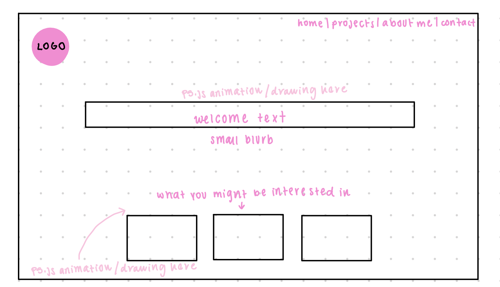
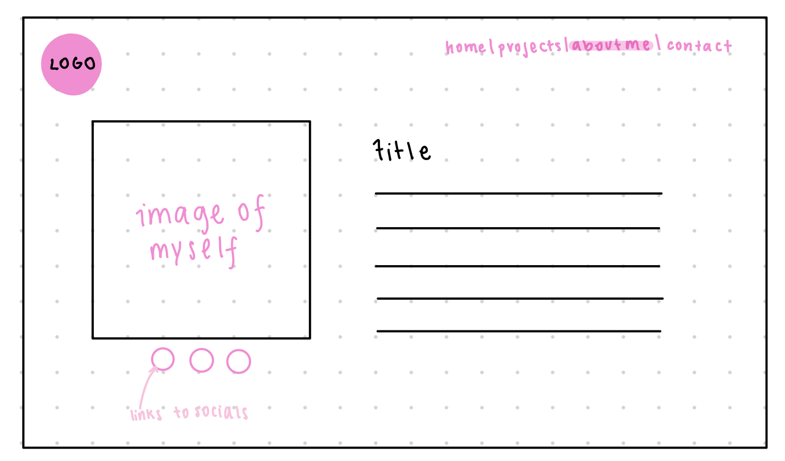
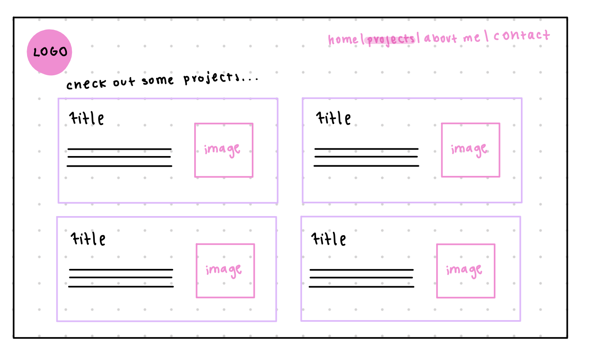
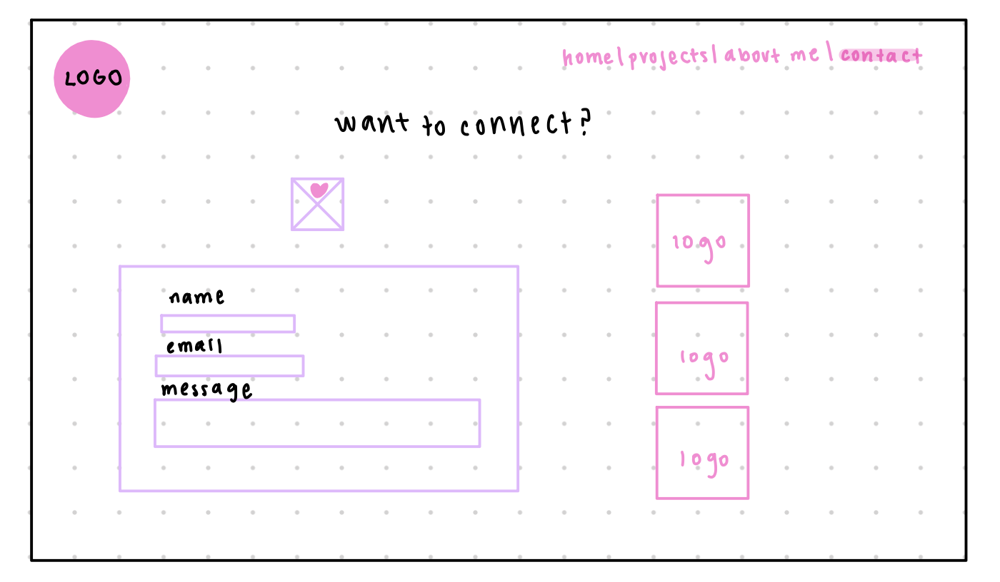
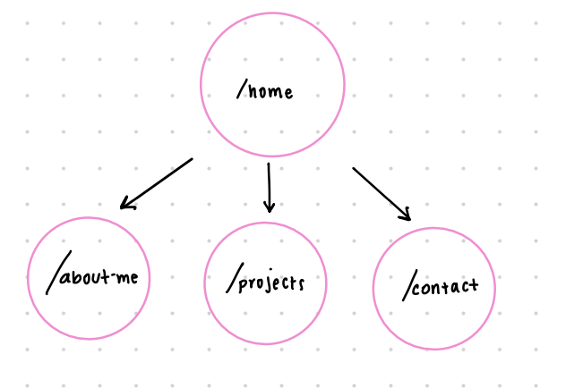

# Sahar's Portfolio ♡

## Overview

This is a website where the user can dive deep into what I have done over the past few years during my personal and professional journey. Users can search for and sort through my projects and gain in-depth knowledge of what I specifically accomplished. Moreover, the user can fill out a contact form so that when the form is submitted, their contact information will be stored in the database, which I can check. Lastly, this website will have interactions that reflect my interests such as design and art.

## Data Model

The application will store Contacts and Projects.

* contacts will be remembered
* projects will be used for searching

An Example Contact:

```javascript
{
firstName: 'misa',
lastName: 'cat',
email: 'misacat@email.com',
message: 'meow'
}
```

An Example Project:

```javascript
{
  id: '12345',
  name: 'my amazing site :-)',
  description: 'this is an amazing site.',
  topics: 'js html css',
  url: 'amazingsite.com',
  created: 'april 26, 2024',
  updated: 'april 27, 2024',
}
```


## [Link to Commented First Draft Schema](db.mjs) 

## Wireframes

/ - introductory page 



/about-me - page about me


/work - page for listing projects



/contact-me - page for user to contact me



## Site map



## User Stories or Use Cases

1. As a visitor, I want to be greeted with an attractive introductory page that gives me an overview of your portfolio.
2. As a visitor, I want easy navigation to access different sections of your website.
3. As a visitor, I want your website to be visually appealing and responsive across different devices and screen sizes.
4. As a visitor, I want your website to load quickly to access the information without delays.
5. As a visitor, I want to be able to easily navigate back to the top of the page, especially on longer pages or project lists.
6. As a visitor, I want each page of the site to be impactful and to tell me about who you are and what you specialize in.
7. As a visitor, I want your website to have a cohesive theme that represents you.

## Research Topics

* (2 points) Use a CSS framework or UI toolkit, use a reasonable of customization of the framework
    ♡ I will use tailwind.css to create custom and efficient css for my site.
* (3 points) Use an External API
    ♡ I will be using the GitHub API to access my project repositories.
* (2 points) Use an external API
    ♡ I will be using the Last.FM API to show the user what I am listening to.

7 points total out of 10 required points

## [Link to Initial Main Project File](src/app.mjs) 
## [Link to Deployed Site](http://linserv1.cims.nyu.edu:22241/)

## Annotations / References Used

### Code References
* https://v2.tailwindcss.com/docs ♡ Tailwind CSS Documentation
* https://www.youtube.com/watch?v=vYowvsUiChs ♡ Responsive Nar Bar in Tailwind CSS Video
* https://www.youtube.com/watch?v=okbDFf-eIqk ♡ Last.fm API Video
* https://dev.to/lornasw93/using-node-js-to-get-useful-github-data-54ne ♡ Using GitHub API Article

### Images
* https://imgbin.com/download/Vz9WCSWu ♡ Sylveon Image
* https://imgbin.com/png/dNSB5uUA/umbreon-pixel-art-pok%C3%A9mon-espeon-png ♡ Umbreon Image

